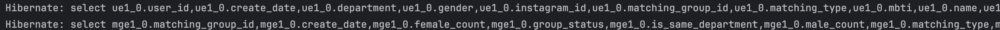

# Cache

## ✅ API Caching

백엔드 기준 API 요청에 대해 계속 DB 쿼리를 통해 조회하는 것은 성능이 떨어진다.  
캐시에 정보를 저장해 놓음으로써 자주 사용하는 API는 DB가 아닌 **캐시에서 바로 응답**할 수 있다.  
즉, DB를 들락날락하지 않으므로 **불필요한 일을 반복하지 않게 된다.**

---

### 📌 장점
- 동일한 요청이 반복적으로 올 때 **API 응답 속도가 빨라진다.**
- **DB 부하 감소**로 전체 시스템의 안정성이 향상된다.

### ⚠️ 단점
- **동일한 요청의 결과가 자주 바뀌는 경우**, 캐시된 데이터가 오래 남아 있으면 오히려 **잘못된 결과**를 줄 수 있고,  
  무효화 전략이 필요하다.
- 캐시 TTL이 짧을수록 관리가 까다롭고, 캐시 적중률이 낮아질 수 있다.

# Spring 내부 캐싱 적용

### ✅ Dependency

```groovy
implementation 'org.springframework.boot:spring-boot-starter-cache'
```
### ✅ CacheConfig

`null`은 캐싱되지 않도록 설정해주기 위해 `CacheConfig`를 별도로 구성했다.  
만약 추가적인 설정이 없다면, 메인 `Application` 파일에 `@EnableCaching`만 추가해도 캐시 기능은 동작한다.

```java
@Configuration
@EnableCaching
public class CachesConfig {

  @Bean
  public RedisCacheManager cacheManager(RedisConnectionFactory cf) {
    GenericJackson2JsonRedisSerializer serializer = new GenericJackson2JsonRedisSerializer();
    RedisSerializationContext.SerializationPair<Object> jsonPair =
        RedisSerializationContext.SerializationPair.fromSerializer(serializer);

    // 캐시별 설정
    Map<String, RedisCacheConfiguration> configs = new HashMap<>();
    configs.put(
        "matchingResult",
        RedisCacheConfiguration.defaultCacheConfig()
            .entryTtl(Duration.ofMinutes(7))            // TTL 7분 설정
            .disableCachingNullValues()                 // null 값은 캐싱하지 않음
            .serializeValuesWith(jsonPair)              // JSON 직렬화 적용
    );

    return RedisCacheManager.builder(cf)
        .withInitialCacheConfigurations(configs)
        .build();
  }
}
```

## ✅ 캐싱 최적화 도입기록

현재 서비스에서는 매칭 결과 API에 대해 캐싱을 도입해 두었습니다.  
기능 개발이 활발하게 진행 중인 초기 단계이므로, 로그인과 같은 다른 기능은 **추후 확장**할 예정입니다.


### 🔐 임시토큰 vs JWT

- **JWT**는 일반적으로 액세스 토큰 + 리프레시 토큰 전략으로 사용하며,
- 반면 **임시 토큰**은 Redis에 저장되며 **로그아웃 시 즉시 삭제**되도록 설계되어 있어 캐싱 적용은 보류했습니다.


### ⚙️ 적용된 캐시 대상: 매칭 결과

- **매칭 결과** API는 반복 호출이 잦고, 결과가 일정 시간 동안 변하지 않기 때문에 캐싱을 적용하기에 적합합니다.
- 1인 사용자마다 `tempToken` 기준으로 개별 캐싱되며, **TTL은 7분**으로 설정해 두었습니다.


### 🛠️ 캐시 설정 위치

캐시 기능을 사용하기 위해 아래 중 **한 곳**에 `@EnableCaching`을 선언하면 됩니다:

- `@SpringBootApplication` 클래스
- 혹은 별도의 `@Configuration` 클래스 (예: `CachesConfig`)


### ✅ 캐시 어노테이션 설명

```java
@Transactional
@CacheEvict(cacheNames = "matchingResult", key = "#tempToken")

```
이 코드는 해당 메서드가 실행될 때 결과 값을 `"matchingResult"`라는 이름의 캐시에  
`#tempToken`을 키로 하여 **저장하게 합니다**.

이후 동일한 토큰으로 요청이 오면 **DB 조회 없이 캐시된 결과를 바로 반환**하게 됩니다.

예를 들어 **매칭을 새로 생성하거나 취소하는 기능**에서 기존 캐시를 제거해야  
**최신 데이터로 다시 반영되도록 하기 위해** 사용됩니다.

```java
@Cacheable(cacheNames = "matchingResult", key = "#tempToken")
```
보통 캐싱은 이런식으로 저장을 하게 한다.

이제 끝이다. 보통 원래 같으면 
### 📉 Before vs After

#### ❌ 캐시를 사용하지 않으면?

- 매번 버튼 클릭이나 요청마다 **Hibernate 쿼리들이 쏟아져 나와** 성능 저하를 일으킨다.
- 동일한 데이터 요청임에도 불구하고 **매번 DB에 접근**하는 낭비가 발생한다.
- 
  

#### ✅ 캐시를 적용하면?

- **첫 요청 이후**, 설정해둔 TTL(예: **7분**) 동안은 쿼리가 발생하지 않는다.
- DB 부하를 줄이고, **응답 속도는 빨라지고**, **서버 리소스와 비용도 절약**할 수 있다.

---

### ✅ 결론

- **캐시는** "변경이 자주 일어나지 않고, 자주 조회되는 데이터"에 **매우 효과적이다.**
- `@Cacheable`, `@CacheEvict` 어노테이션을 적절히 사용하면, **쿼리 최적화와 성능 향상**을 동시에 이룰 수 있다.
- **불필요한 DB 조회를 줄이고**, 서버 부하를 감소시켜 **보다 효율적인 백엔드 운영**이 가능해진다.

